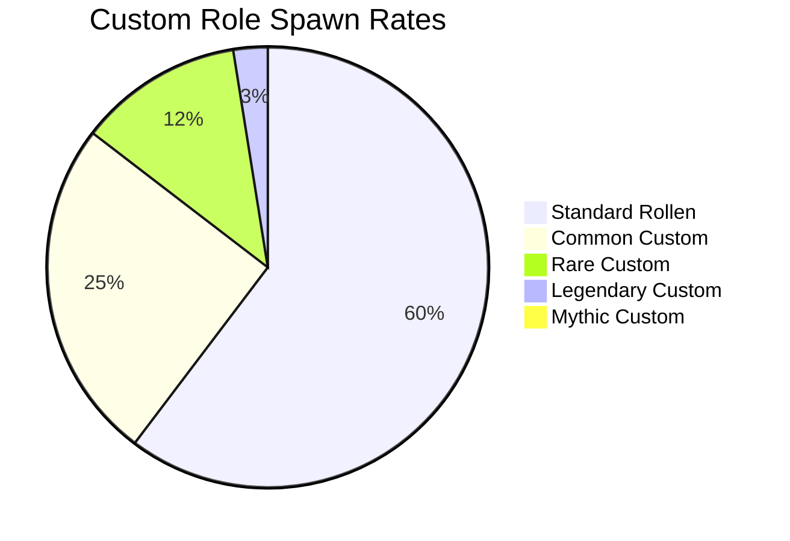

# 🌟 Custom Rollen Übersicht


**Zeitvertreib-Exklusiv!** Diese einzigartigen Rollen findest du nur auf unserem Server und bieten völlig neue Spielerfahrungen! ✨


## 🎭 Was sind Custom Rollen?

**Custom Rollen** sind speziell für unseren Server entwickelte Charaktere mit einzigartigen Fähigkeiten, die das Standard-SCP:SL Gameplay erweitern und verbessern.

### 🌟 Besonderheiten



* 🔮 **Spezielle Powers** - Einzigartige Superkräfte
* 🛡️ **Custom Health** - Angepasste Lebenspunkte
* ⚡ **Besondere Geschwindigkeit** - Schneller oder langsamer
* 🎨 **Visuelle Effekte** - Spezielle Partikel und Animationen
* 🔊 **Custom Sounds** - Einzigartige Geräuscheffekte



* 🔄 **Neue Strategien** - Andere Spielweise erforderlich
* 🤝 **Team-Dynamik** - Veränderte Rollenverhältnisse
* 🎯 **Ziel-Variation** - Unterschiedliche Siegbedingungen
* ⚔️ **Kampf-Mechaniken** - Neue Kampfstile
* 🗺️ **Map-Interaktion** - Spezielle Raum-Fähigkeiten



* ⚖️ **Faire Verteilung** - Ausgewogene Teams
* 🎲 **Zufällige Auswahl** - RNG-basiertes Spawning
* 📊 **Statistik-Tracking** - Performance-Monitoring
* 🔧 **Regelmäßige Updates** - Balance-Anpassungen
* 🎯 **Community-Feedback** - Spieler-Input berücksichtigt



## 📋 Rollen-Kategorien

### 🧪 SCP-Kategorien

| Kategorie | Anzahl Rollen | Schwierigkeit | Besonderheit |
|-----------|---------------|---------------|--------------|
| **🦴 Euclid Plus** | 8 | ⭐⭐⭐ | Erweiterte Standard-SCPs |
| **💀 Keter Evolved** | 5 | ⭐⭐⭐⭐ | Übermächtige Versionen |
| **🌟 Custom Entities** | 12 | ⭐⭐⭐⭐⭐ | Völlig neue SCPs |
| **👑 Boss SCPs** | 3 | ⭐⭐⭐⭐⭐ | Event-exklusive Mega-SCPs |

### 👥 Human-Kategorien

| Kategorie | Anzahl Rollen | Schwierigkeit | Besonderheit |
|-----------|---------------|---------------|--------------|
| **🔬 Scientist Elite** | 6 | ⭐⭐ | Erweiterte Wissenschaftler |
| **🛡️ Security Plus** | 7 | ⭐⭐⭐ | Verstärkte Sicherheitskräfte |
| **🎭 D-Class Variants** | 9 | ⭐⭐ | Spezielle D-Personal |
| **🚁 Task Forces** | 11 | ⭐⭐⭐⭐ | Elite-Militäreinheiten |

## 🎯 Spawn-System

### 🎲 Zufallssystem


**RNG-Based Spawning:** Custom Rollen werden zufällig verteilt, um Fairness zu gewährleisten!


#### 📊 Spawn-Wahrscheinlichkeiten

#### 🎮 Spawn-Bedingungen



**👤 Spieleranzahl**
Mindestens 15 Spieler für Custom Role Spawns



**⏰ Runden-Zeit**
Erste 30 Sekunden: Erhöhte Spawn-Chance



**🎯 Balancing**
Automatische Team-Balance berücksichtigt



**🎪 Event-Modus**
Spezielle Events mit 100% Custom Rate



## 🔮 Fähigkeiten-System

### ⚡ Aktive Fähigkeiten

**Aktivierung:** Verschiedene Keybinds je nach Rolle

| Taste | Funktion | Cooldown | Beispiel |
|-------|----------|----------|----------|
| **Q** | Primäre Fähigkeit | 10-30s | Teleportation |
| **E** | Sekundäre Fähigkeit | 15-45s | Heilung |
| **F** | Utility-Fähigkeit | 5-15s | Scan-Bereich |
| **Z** | Ultimate-Fähigkeit | 60-120s | Massenteleport |

### 🛡️ Passive Fähigkeiten

**Permanent aktiv** ohne Aktivierung erforderlich:

* 🏃 **Geschwindigkeits-Modifikationen**
* 💪 **Schadens-Resistenzen**
* 👁️ **Erweiterte Sicht** (Nachtsicht, Wallhack)
* 🔊 **Audio-Enhancements** (Geräusch-Tracking)
* ⚡ **Regeneration** (Health/Armor/Energy)

## 🎮 Spieler-Guides

### 📚 Rollen-spezifische Guides


**Wichtig:** Jede Custom Rolle hat einzigartige Mechaniken. Lese die spezifischen Guides!


* 🧪 [**SCP Custom Rollen**](scp-roles.md) - Anomale Entitäten
* 👨‍🔬 [**Wissenschaftler Varianten**](scientist-roles.md) - Research Personnel
* 🛡️ [**Sicherheitskräfte**](security-roles.md) - Facility Security
* 🎭 [**Spezial-Rollen**](special-roles.md) - Einzigartige Charaktere

### 🎯 Allgemeine Tipps

#### 🔍 Rolle identifizieren

1. **👀 Visual Cues** - Spezielle Modelle/Farben
2. **🔊 Audio Hints** - Unique Spawn-Sounds
3. **📱 HUD-Elements** - Custom UI-Elemente
4. **⚡ Fähigkeiten testen** - Keybinds ausprobieren

#### 🎮 Effektiv spielen



* 🎯 **Rollenziel verstehen** - Was ist deine Mission?
* 🤝 **Team-Synergien** - Wie hilfst du deinem Team?
* ⚔️ **Gegner-Analyse** - Schwächen der Feinde nutzen
* 🗺️ **Map-Kontrolle** - Wichtige Bereiche sichern



* ⏰ **Cooldown-Timing** - Fähigkeiten optimal einsetzen
* ⚡ **Resource-Management** - Energy/Stamina sparen
* 🎯 **Situational Awareness** - Wann welche Fähigkeit?
* 🤝 **Team-Koordination** - Fähigkeiten kombinieren



* 🏃 **Mobility nutzen** - Beweglichkeits-Vorteile
* 🛡️ **Deckung suchen** - Schutz vor Angriffen
* 👥 **Team-Position** - Synergien maximieren
* 🗺️ **Map-Knowledge** - Shortcuts und Verstecke



## 📊 Statistiken & Tracking

### 📈 Performance-Metrics

**Verfolge deine Custom Role Performance:**

* 🎯 **Spawn-Rate** - Wie oft erhältst du Custom Rollen?
* ⏱️ **Survival-Time** - Durchschnittliche Überlebenszeit
* 🏆 **Win-Rate** - Erfolgsquote mit verschiedenen Rollen
* 💀 **Kill/Death Ratio** - Kampfleistung
* 🤝 **Team-Contribution** - Wie hilfst du deinem Team?

### 🏅 Achievements

**Spezielle Erfolge für Custom Roles:**



* 👑 **Role Master** - 100 Siege mit einer Custom Rolle
* 🌟 **Legendary Player** - Alle Legendary Rollen gespielt
* 🎯 **Perfect Game** - Flawless Victory mit Custom Rolle
* 🤝 **Team Player** - 50 Team-Siege unterstützt



* ⚡ **Speed Runner** - Schnellste Runden-Completion
* 💀 **Elimination Expert** - Multi-Kills mit Custom Abilities
* 🛡️ **Defender** - Erfolgreiche Base-Defense
* 🎪 **Event Champion** - Event-Victory mit Custom Role



* 📚 **Collector** - 50 verschiedene Custom Rollen gespielt
* 🎭 **Variety Master** - Jede Kategorie gemeistert
* 🎲 **Lucky Player** - Seltene Rollen erhalten
* 📊 **Data Master** - Alle Statistiken maximiert



## 🔄 Updates & Balance

### 📅 Update-Schedule


**Regelmäßige Updates:** Custom Rollen werden kontinuierlich verbessert und erweitert!


* 📋 **Wöchentlich** - Balance-Anpassungen
* 🎯 **Monatlich** - Neue Rollen-Releases
* 🎪 **Saisonal** - Major Content-Updates
* 🔧 **Bei Bedarf** - Hotfixes und Bugfixes

### 📊 Community-Feedback

**Deine Meinung zählt!**

* 📝 **Feedback-Forms** - Strukturiertes Feedback
* 💬 **Discord-Discussions** - Community-Diskussionen
* 📊 **Umfragen** - Regelmäßige Polls
* 🎮 **Test-Sessions** - Beta-Testing neuer Rollen

### 🔧 Balance-Philosophie

**Unsere Grundsätze:**

1. **⚖️ Fairness** - Keine Rolle soll übermächtig sein
2. **🎯 Vielfalt** - Jede Rolle soll einzigartig sein
3. **🎮 Spaß** - Fun-Factor über alles
4. **🤝 Team-Balance** - Ausgeglichene Teams
5. **📊 Data-Driven** - Entscheidungen basierend auf Statistiken

---


**Bereit für Custom Roles?** Springe ins Spiel und entdecke die einzigartigen Möglichkeiten! Jede Runde kann ein neues Abenteuer werden! 🎮✨

