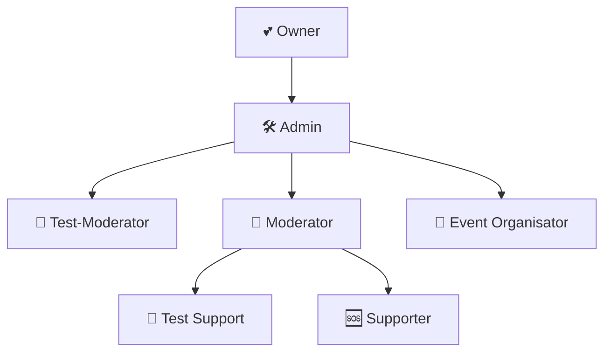

# 👑 Team-Struktur


**Unser Team** arbeitet 24/7 daran, euch das beste SCP:SL Erlebnis zu bieten! Das ist unser Team!


## 🏛️ Hierarchie-Übersicht

## 👥 Team-Rollen

### 💕 Owner

**Gesamtverantwortung für den Server**


**Discord:** @grosskoenig


**Verantwortlichkeiten:**

- 🏗️ Server-Management und -entwicklung
- 💰 Finanzierung und Hosting
- 🔧 Plugin-Entwicklung

---

### 🛠️ Admin

**Team Leitung und Server-Management**

**Aufgaben:**

- 👥 Team Koordination
- 📊 Performance-Monitoring

**Befugnisse:**

- 👤 Team-Ernennungen und -entlassungen
- 📋 Server-Regeln definieren

---

### 👮 Moderator

**Erfahrene Moderatoren für umfassende Server-Betreuung**

#### 🎯 Tägliche Aufgaben

- 👮 Server-Betreung und Moderation
- ⚖️ Komplexe Beschwerden bearbeiten
- 🎪 Event-Unterstützung und -durchführung
- 🏫 Betreung von Test Moderatoren
- 👥 Spieler-Support (Tickets)
- 📋 Report-Bearbeitung

**Befugnisse:**

- ⚠️ Verwarnungen aussprechen
- 🔇 Permanente Mutes
- 💢 Kick-Befugnis
- 🗯️ Permanente Bans
- ✍️ Bearbeiten von existierenden Verwarnungen, Mutes oder Bans.
- 🕊️ Entbannunganträge bearbeiten

---

### 🎯 Test Moderator

**Moderatoren in der Ausbildung mit begrenzten Befugnissen**

**Aufgaben:**

- 👮 Server-Betreung und Moderation
- 🎪 Event-Unterstützung und -durchführung
- 🏫 Betreung von Test Moderatoren
- 👥 Spieler-Support (Tickets)
- 📋 Report-Bearbeitung

**Befugnisse:**

- ⚠️ Verwarnungen aussprechen
- 🔇 Permanente Mutes
- 💢 Kick-Befugnis
- 🗯️ Permanente Bans

---

### 🆘 Supporter

**Helfende Hand für die aktive Spielerbasis**

**Aufgaben:**

- 🔍 Generelle Discord und SCP Server Betreung
- 👥 Spieler-Support bei grundlegenden Fragen
- 🤬 Konfliktlösung bei Supportgesprächen
- 📋 Report-Bearbeitung
- 📚 Regelwerk erklären

**Befugnisse:**

- ⚠️ Verwarnungen aussprechen
- 🔇 Mutes (zeitlich Begrenzt)
- 💢 Kick-Befugnis
- 🗯️ Bans (zeitlich Begrenzt)

---

### 🧪 Test Support

**Einsteiger im Team mit grundlegenden Befugnissen**

**Aufgaben:**

- 💬 Chat-Überwachung und grundlegende Moderation
- 🆘 Neue Spieler beim Einstieg helfen
- 📋 Einfache Fragen beantworten
- 📚 Regelwerk erklären
- 📋 Report-Bearbeitung unter Anleitung anderer Teammitglieder

**Befugnisse:**

- ⚠️ Verwarnungen aussprechen
- 🔇 Mutes (stark zeitlich Begrenzt)
- 💢 Kick-Befugnis
- 🗯️ Bans (stark zeitlich Begrenzt)

## 🌟 Spezialisierte Rollen

### 🎪 Event Organizer

**Spezialist für Server-Events und Community-Activities**


**Fokus:** Planung und Durchführung von spannenden Server-Events


**Event-Typen:**

- 🎭 **Roleplay-Events** - Immersive Story-driven Events
- 🎉 **Fun-Events** - z.B. Hide & Seek
- 💡 **Video-Drehs** - für YouTube!

**Aufgaben:**

- 🎁 Event-Belohnungen verteilen
- 📅 Events Ankündigen

## 📞 Team kontaktieren

### 🎫 Support-System


**Support nur über Discord-Tickets** - Erstelle einfach ein Ticket in unserem Discord Server!


## 🤝 Team beitreten

### 📋 Bewerbungsprozess

Interessiert an einer Position in unserem Team? So läuft es ab:



**📢 Ankündigung**

- Wir posten eine Ankündigung auf dem Discord Server
- Ihr habt **1 Monat Zeit** für eure Bewerbung
- Bewerbung über die bereitgestellten Formulare
  


**📝 Bewerbung einreichen**

- Bewerbungsformular vollständig ausfüllen
- Motivation klar erklären
- Verfügbarkeit ehrlich angeben
  


**🎯 Auswahlprozess**

- Wir schauen uns alle Bewerbungen an
- Die besten Individuen werden ausgewählt
- Benachrichtigung der ausgewählten Bewerber
  


**🎓 Schulung**

- Schulung in unseren Administration Tools
- Einarbeitung in die Team-Prozesse
- Offizielle Aufnahme ins Team
  
  

### 📋 Voraussetzungen

- ✅ **16+ Jahre alt**
- ✅ **50+ Stunden** auf dem Server
- ✅ **Saubere Warn-Ban-Mute History**
- ✅ **Gute Englisch/Deutsch** Kenntnisse
- ✅ **Verfügbarkeit** irreleavant

---


**Unser Team freut sich auf dich!** Bei Fragen zum Bewerbungsprozess, kontaktiere uns gerne über Discord! 💬

