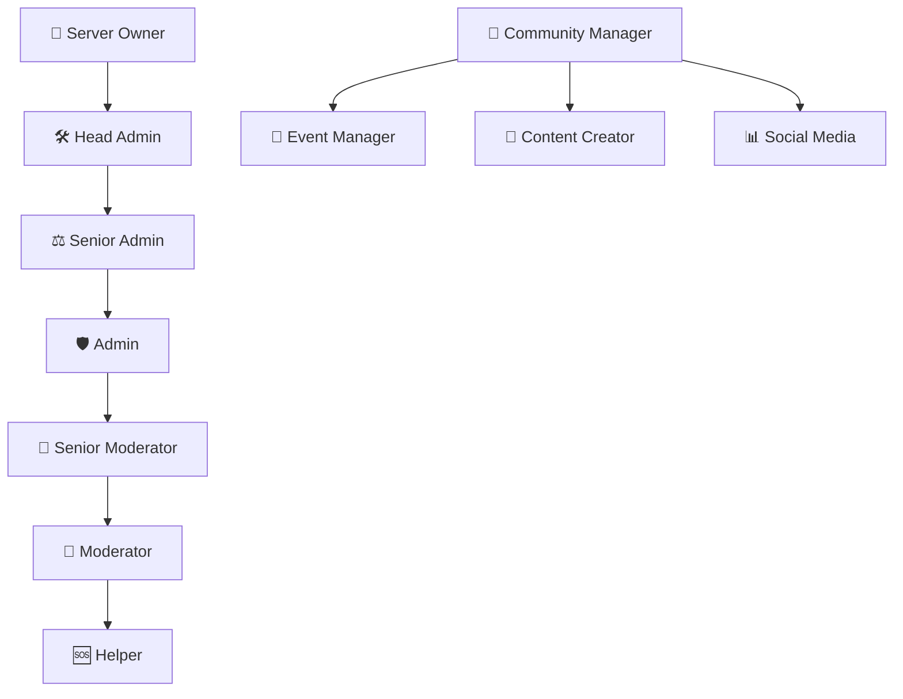

# 👑 Team-Struktur


**Unser Team** arbeitet 24/7 daran, euch das beste SCP:SL Erlebnis zu bieten! Lernt uns kennen! 🌟


## 🏛️ Hierarchie-Übersicht



## 👥 Team-Rollen

### 👑 Server Owner
**Gesamtverantwortung für den Server**


**Kontakt:** Nur bei kritischen Server-Problemen oder wichtigen Anfragen


**Verantwortlichkeiten:**
- 🏗️ Server-Management und -entwicklung
- 💰 Finanzierung und Hosting
- 📋 Strategische Entscheidungen
- 🤝 Community-Partnerschaften
- 🔧 Plugin-Entwicklung Oversight

---

### 🛠️ Head Admin
**Technische Leitung und Admin-Management**

**Aufgaben:**
- ⚙️ Server-Konfiguration und Updates
- 👥 Admin-Team Koordination
- 🔌 Plugin-Installation und -wartung
- 📊 Performance-Monitoring
- 🚨 Kritische Incident-Response

**Befugnisse:**
- 🔧 Vollzugriff auf Server-Einstellungen
- 👤 Admin-Ernennungen und -entlassungen
- 🗺️ Map-Rotationen verwalten
- 📋 Server-Regeln definieren

---

### ⚖️ Senior Admin
**Erfahrene Administratoren mit erweiterten Befugnissen**



- 🛡️ Community-Moderation Oversight
- 📝 Appeal-Bearbeitung (schwere Fälle)
- 🎯 Admin-Training und -unterstützung
- 📊 Team-Performance Reviews
- 🔍 Cheat-Detection und -investigation



- 👤 Permanent Bans verhängen/aufheben
- 🎮 Server-Events organisieren
- 📋 Regel-Updates vorschlagen
- 🎭 Custom-Role Anpassungen
- 📊 Statistiken und Reports erstellen



---

### 🛡️ Admin
**Vollzugriff-Moderatoren für umfassende Server-Betreuung**

#### 🎯 Tägliche Aufgaben
- 👮 Server-Überwachung und Moderation
- ⚖️ Komplexe Beschwerden bearbeiten
- 🎪 Event-Unterstützung und -durchführung
- 👥 Spieler-Support (Tickets)
- 📋 Report-Bearbeitung

#### 🔧 Admin-Commands
```
!ban [player] [time] [reason]     - Spieler bannen
!kick [player] [reason]           - Spieler kicken
!mute [player] [time] [reason]    - Spieler stumm schalten
!teleport [player] [room]         - Spieler teleportieren
!heal [player]                    - Spieler heilen
!size [player] [scale]            - Spielergröße ändern
!god [player]                     - God-Mode aktivieren
!noclip [player]                  - NoClip aktivieren
```

---

### 🎯 Senior Moderator
**Erfahrene Moderatoren mit Führungsverantwortung**

**Spezialisierungen:**
- 🎪 **Event-Moderation** - Leitung von Server-Events
- 🎭 **Roleplay-Coordination** - RP-Events und Custom-Scenarios
- 👥 **New-Player Support** - Einsteiger-Betreuung
- 📊 **Community-Feedback** - Spieler-Vorschläge sammeln

**Zusätzliche Befugnisse:**
- ⏰ Längere Bans verhängen (bis 7 Tage)
- 🎯 Moderator-Training durchführen
- 📋 Schichtpläne koordinieren
- 🎪 Mini-Events eigenständig leiten

---

### 👮 Moderator
**Kern-Moderationsteam für tägliche Server-Betreuung**

#### 📋 Hauptverantwortlichkeiten



**🔍 Aktive Überwachung**
- Chat- und Voice-Monitoring
- Verdächtiges Verhalten erkennen
- Reports zeitnah bearbeiten



**⚖️ Regel-Durchsetzung**
- Verwarnungen aussprechen
- Temporäre Strafen verhängen
- Dokumentation von Vorfällen



**🆘 Spieler-Support**
- Fragen beantworten
- Konflikte schlichten
- Technische Hilfe bieten



**📊 Berichterstattung**
- Tägliche Activity-Reports
- Incident-Dokumentation
- Team-Kommunikation



#### 🛠️ Moderator-Commands
```
!warn [player] [reason]           - Verwarnung aussprechen
!kick [player] [reason]           - Spieler kicken
!mute [player] [time] [reason]    - Temporär muten
!unmute [player]                  - Mute aufheben
!spectate [player]                - Spieler beobachten
!bring [player]                   - Spieler zu sich holen
!goto [player]                    - Zu Spieler teleportieren
```

---

### 🆘 Helper
**Einsteiger im Team mit begrenzten Befugnissen**

**Aufgaben:**
- 💬 Chat-Überwachung und grundlegende Moderation
- 🆘 Neue Spieler beim Einstieg helfen
- 📋 Einfache Reports bearbeiten
- 👥 Community-Events unterstützen
- 📚 Regelwerk erklären

**Befugnisse:**
- ⚠️ Verwarnungen aussprechen
- 🔇 Kurze Mutes (max. 30 Min)
- 📞 Höherrangige Teammitglieder rufen
- 👀 Spieler-Aktivitäten beobachten

## 🌟 Spezialisierte Rollen

### 💼 Community Manager
**Verantwortlich für Community-Engagement und Growth**


**Fokus:** Aufbau einer starken, aktiven Community rund um den Server


**Hauptaufgaben:**
- 📈 Community-Growth Strategien entwickeln
- 🎯 Engagement-Programme planen
- 📊 Community-Feedback sammeln und analysieren
- 🤝 Partnerschaften mit anderen Communities
- 📱 Social Media Management koordinieren

---

### 🎪 Event Manager
**Spezialist für Server-Events und Community-Activities**

**Event-Typen:**
- 🏆 **Turniere** - Competitive SCP:SL Matches
- 🎭 **Roleplay-Events** - Immersive Story-driven Events
- 🎉 **Fun-Events** - Hide & Seek, Racing, etc.
- 🎂 **Special Occasions** - Feiertage, Jubiläen
- 💡 **Community-Challenges** - Kreative Aufgaben

**Tools & Befugnisse:**
- 🎯 Custom-Game Modes aktivieren
- 🎁 Event-Belohnungen verteilen
- 📅 Event-Kalender verwalten
- 🎪 Spezielle Server-Konfigurationen

---

### 🎨 Content Creator
**Verantwortlich für kreative Inhalte und Media**

**Kreative Bereiche:**
- 🎬 **Video-Content** - Highlights, Tutorials, Promos
- 📸 **Screenshots** - Server-Momente dokumentieren
- 🎨 **Grafik-Design** - Logos, Banner, Thumbnails
- 📝 **Artikel** - Wiki-Updates, News-Posts
- 🎵 **Audio-Content** - Intro-Sounds, Jingles

## 📞 Team kontaktieren

### 🎫 Support-System



**Für dringende Probleme:**

- 🚨 **!admin** - Im Spiel verwenden
- 💬 **@Staff** - Im Discord
- 📞 **Emergency-Channel** - Für kritische Fälle

**Reaktionszeit:** < 5 Minuten



**Für normale Anfragen:**

- 🎫 **Support-Ticket** erstellen
- 📧 **Direktnachricht** an Teammitglied
- 💬 **#help-channel** im Discord

**Reaktionszeit:** < 2 Stunden



**Für Verbesserungsideen:**

- 📝 **#suggestions** Channel
- 📊 **Community-Umfragen**
- 💬 **Community-Meetings**

**Bearbeitungszeit:** 1-7 Tage



### 📅 Team-Verfügbarkeit

| Zeitzone | Mo-Fr | Sa-So | Verantwortlicher |
|----------|-------|-------|------------------|
| **EU Morning** | 06:00-12:00 | 08:00-14:00 | EU Team |
| **EU Afternoon** | 12:00-18:00 | 14:00-20:00 | Mixed Team |
| **EU Evening** | 18:00-24:00 | 20:00-02:00 | Primary Team |
| **EU Night** | 00:00-06:00 | 02:00-08:00 | Night Shift |

## 🤝 Team beitreten

### 📋 Bewerbungsprozess

Interessiert an einer Position in unserem Team? Hier der Weg:



**📚 Vorbereitung**
- Server-Regeln perfekt kennen
- Mindestens 2 Wochen aktiv gespielt
- Positive Community-Reputation
- Discord-Account verknüpft



**📝 Bewerbung**
- Bewerbungsformular ausfüllen
- Motivation erklären
- Verfügbarkeit angeben
- Referenzen nennen



**🎯 Auswahlprozess**
- Application Review
- Interview mit Senior Staff
- Probezeit (2 Wochen)
- Finale Entscheidung



**🎓 Onboarding**
- Team-Training absolvieren
- Mentor-Zuteilung
- Tool-Schulungen
- Offizielle Aufnahme



### 📋 Voraussetzungen

#### 🆘 Helper Requirements
- ✅ **16+ Jahre alt**
- ✅ **100+ Stunden** auf dem Server
- ✅ **Saubere Warn-History** (keine aktiven Warns)
- ✅ **Gute Englisch/Deutsch** Kenntnisse
- ✅ **Verfügbarkeit** min. 10h/Woche

#### 👮 Moderator Requirements
- ✅ **18+ Jahre alt**
- ✅ **200+ Stunden** auf dem Server
- ✅ **Helper-Erfahrung** oder vergleichbar
- ✅ **TeamSpeak/Discord** Erfahrung
- ✅ **Konfliktlösung** Skills

---


**Unser Team freut sich auf dich!** Bei Fragen zum Bewerbungsprozess, kontaktiere uns gerne über Discord! 💬

